@[TOC](目录)

## 一、激光雷达的工作原理

激光雷达根据测量原理可以分为三角法激光雷达、脉冲法激光雷达、相干法激光雷达。本文我们只针对脉冲法测距的激光雷达做分析。

几中主流的激光雷达优缺点，

**基于脉冲法的激光雷达利用光速测距。** 激光发射器发射激光脉冲，计时器记录发射时间；脉冲经物体反射后由接收器接受，计时器记录接受时间；时间差乘上光速即得到距离的两倍。用此方法来衡量雷达到障碍物之间的距离。

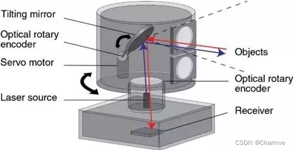

### 1.1 单线激光雷达

单线激光雷达是目前成本最低的激光雷达。成本低，意味着量产的可能性大。

单线激光雷达的原理可以通过下图理解。
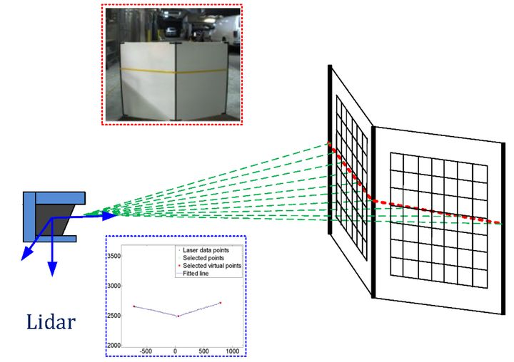

单束激光发射器在激光雷达内部进行匀速的旋转，每旋转一个小角度即发射一次激光，轮巡一定的角度后，就生成了一帧完整的数据。因此，单线激光雷达的数据可以看做是同一高度的一排点阵。

缺点：单线激光雷达的数据缺少一个维度，只能描述线状信息，无法描述面。如上图，可以知道激光雷达的面前有一块纸板，并且知道这块纸板相对激光雷达的距离，但是这块纸板的高度信息无从得知。

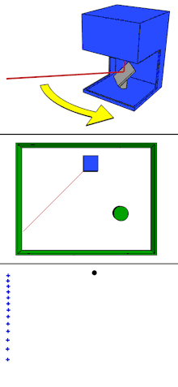

### 1.2 四线激光雷达

如上图所示，四线激光雷达基本都像这样。

全新的奥迪A8为了实现Level 3级别的自动驾驶，也在汽车的进气格栅下布置的四线激光雷达ScaLa。

有了之前单线激光雷达的原理介绍，四线激光雷达的工作原理就很容易理解了。

如下图所示，不同的颜色代表不同的激光发射器。

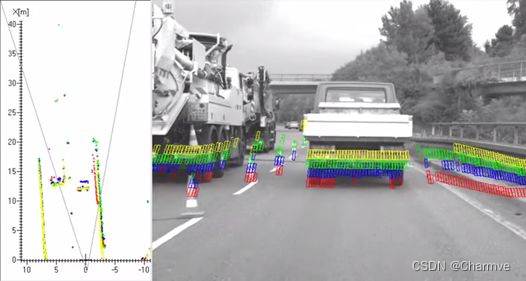

四线激光雷达将四个激光发射器进行轮询，一个轮询周期后，得到一帧的激光点云数据。四条点云数据可以组成面状信息，这样就能够获取障碍物的高度信息。

根据单帧的点云坐标可得到障碍物的距离信息。

根据多帧的点云的坐标，对距离信息做微分处理，可得到障碍物的速度信息。

实际应用时，在购买激光雷达的产品后，其供应商也会提供配套的软件开发套件（SDK，Software Development Kit），这些软件开发套件能很方便地让使用者得到精准的点云数据，而且为了方便自动驾驶的开发，甚至会直接输出已经处理好的障碍物结果。

如下图绿的的矩形框即为障碍物相对于自车的位置，矩形框的前端有个小三角，表示障碍物的运动方向。

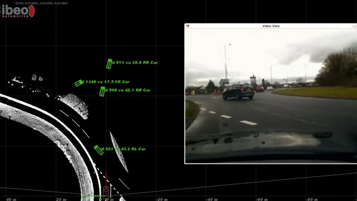

### 1.3 16/32/64线激光雷达

16/32/64线的激光雷达的感知范围为360°，为了最大化地发挥他们的优势，常被安装在无人车的顶部。

三款激光雷达的技术参数和成本如下图。

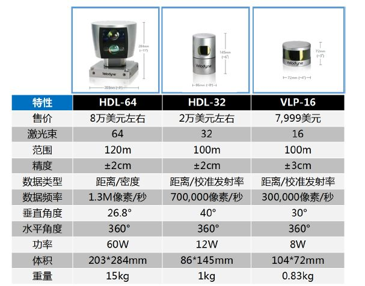

360°的激光数据可视化后，就是大家经常在各种宣传图上看到的效果，如下图。
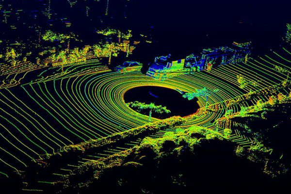

图中的每一个圆圈都是一个激光束产生的数据，激光雷达的线束越多，对物体的检测效果越好。比如64线的激光雷达产生的数据，将会更容易检测到路边的马路牙子。

16/32/64线的激光雷达只能提供原始的点云信号，没有对应的SDK直接输出障碍物结果。因此各大自动驾驶公司都在点云数据基础上，自行研究算法完成无人车的感知工作。

## 二、激光雷达的数据
激光雷达的点云数据结构比较简单。以N线激光雷达为例来讲解点云的数据结构。

在实际的无人驾驶系统中，每一帧的数据都会有时间戳，根据时间戳进行后续和时间有关的计算（如距离信息的微分等）。因此N线激光雷达的点云数据结构如下图。

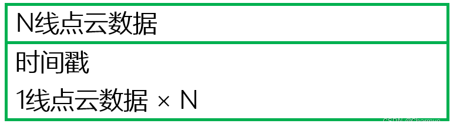

每一线点云的数据结构又是由点云的数量和每一个点云的数据结构组成。由于激光雷达的数据采集频率和单线的点云数量都是可以设置的，因此1线点云数据中需要包含点云数量这个信息。

最底层的是单个点云的数据结构。点的表达既可以使用theta/r的极坐标表示，也可以使用x/y/z的3维坐标表示。

每个点云除了坐标外，还有一个很重要的元素，那就是激光的反射强度。激光在不同材料上的反射强度是不一样的。以3维坐标的表示方法为例，单个点云的数据结构如下图。X/Y/Z方向的偏移量是以激光雷达的安装位置作为原点。

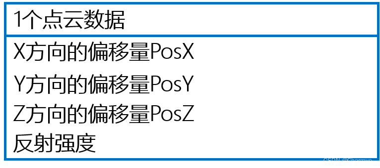

## 三、激光雷达能做什么？
激光雷达点云数据的一般处理方式是：数据预处理（坐标转换，去噪声等），聚类（根据点云距离或反射强度），提取聚类后的特征，根据特征进行分类等后处理工作。

以百度Apollo 2.0目前已开放的功能为例，看看激光雷达能完成哪些工作。

### 3.1 障碍物检测与分割

利用高精度地图限定感兴趣区域（ROI，Region of Interest）后，基于全卷积深度神经网络学习点云特征并预测障碍物的相关属性，得到前景障碍物检测与分割。

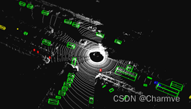

### 3.2 可通行空间检测

利用高精度地图限定ROI后，可以对ROI内部（比如可行驶道路和交叉口）的点云的高度及连续性信息进行判断点云处是否可通行。

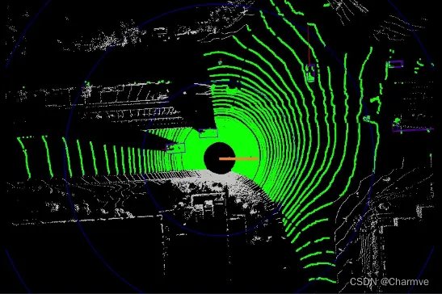

### 3.3 高精度电子地图制图与定位

利用多线激光雷达的点云信息与地图采集车载组合惯导的信息，进行高精地图制作。自动驾驶汽车利用激光点云信息与高精度地图匹配，以此实现高精度定位。

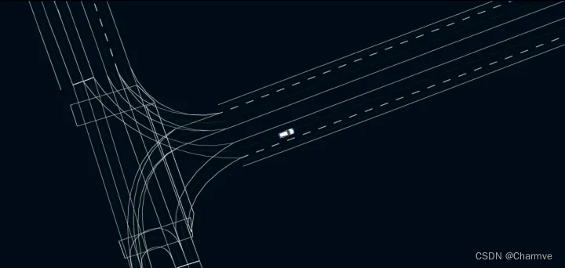

### 3.4 交通参与者的轨迹预测

根据激光雷达的感知数据与障碍物所在车道的拓扑关系（道路连接关系）进行障碍物的轨迹预测，以此作为无人车规划（避障、换道、超车等）的判断依据。

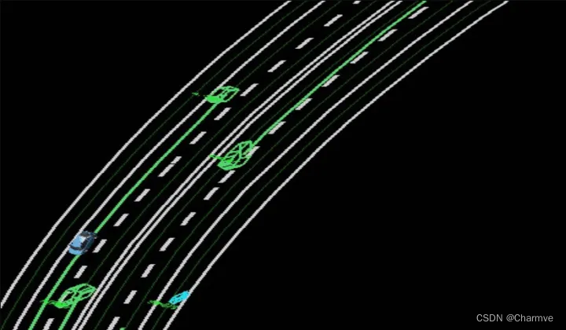

## 四、激光点云感知

深度学习方法分类
### 4.1  Pixel-based
把点存在平面中。点投影到平面上，用2D CNN处理。
### 4.2 Point-Based
这是更直接的方法，把点存在向量中，输入n×3的向量直接送入网络中。

此时有两个问题：
（1）无序性：每个点云图点云个数不同，n值不一样。
（2）点在向量中有大量的排列组合方式，必须保证网络对这些点的顺序不敏感。

要使得数据变得卷积友好，必须进行预处理，有以下图片中的三步：

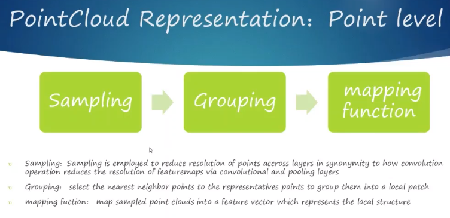

典型案例PointNet网络图：

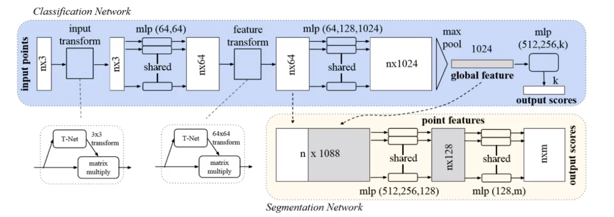

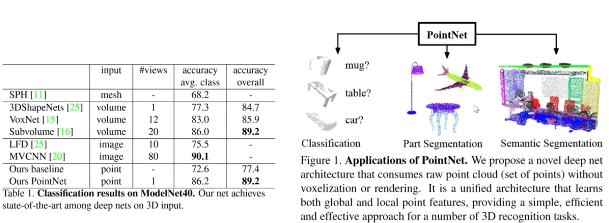

### 4.3 Voxel-Based：

把点存在立体中。

类似于图像一样，图像是二维的把其进行栅格化，变成一个一个的像素，三维的我们也可以进行栅格化变成一个一个的体素(就是一个个小的立方体)。采用3D CNN进行处理，3D CNN结构如下：

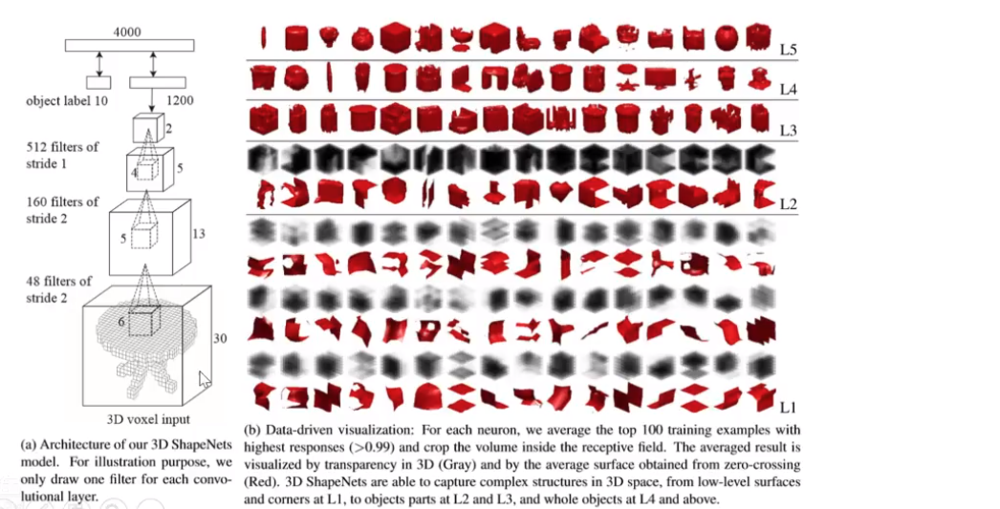
 

### 4.4 数据的标签是什么形式的？
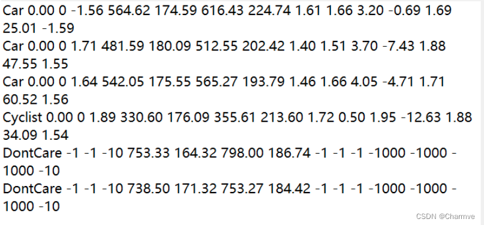
