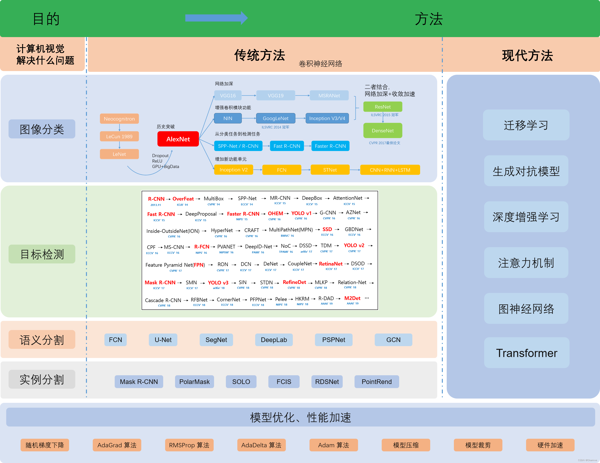

@[TOC](目录)

## 1 网络分类

来自：https://charmve.github.io/computer-vision-in-action/#/book_preface

## 2 详解 ResNet

https://zh.d2l.ai/chapter_convolutional-modern/resnet.html

## 3 详解 VGG
https://zh.d2l.ai/chapter_convolutional-modern/vgg.html

## 4 稠密连接网络（DenseNet）

https://zh.d2l.ai/chapter_convolutional-modern/densenet.html

## 5 详解 GoogLeNet

https://zh.d2l.ai/chapter_convolutional-modern/googlenet.html

## 6 详解 Fast R-CNN

