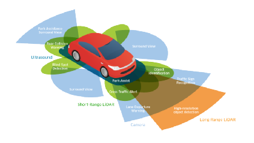
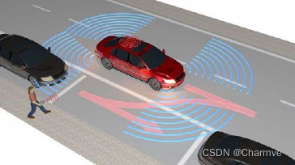
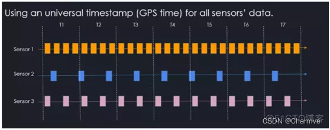
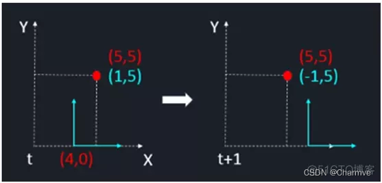
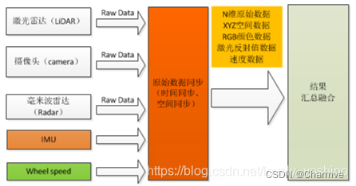

@[TOC](目录)

我们先来看几段头部自动驾驶公司的“秀肌肉💪”！

- Momenta自动驾驶感知能力展示
 https://www.zhihu.com/zvideo/1358498613975506944

- 自动驾驶晚高峰路测一镜到底 | Momenta
 https://www.zhihu.com/zvideo/1294414088106885121

- 小马智行·自动驾驶车晚高峰行驶
 https://www.zhihu.com/zvideo/1356296581868806144

- 轻舟DBQ-V4 自动驾驶城市场复杂场景技术展示
 https://www.bilibili.com/video/BV1Nt4y147Wf/

- 文远知行自动驾驶微循环小巴广州首发
 https://www.zhihu.com/zvideo/1337753496306155521

- 元戎启行自动驾驶感知能力展示
 https://www.bilibili.com/video/BV1q64y1e7FW

- 元戎启行无人车深圳闹市区1小时路测 
 https://www.zhihu.com/zvideo/1361007572510760960

 

在自动驾驶的感知领域中，基于单个传感器的感知往往具有着信息不足，特定环境下无法稳定适用，价格成本等等的顾虑，这也就造成了目前市面上大多数自动驾驶企业都会为一辆自动驾驶汽车配备数量、种类繁多的传感器，为的便是充分利用上每个传感器的特点以及适用场景，在可控成本的基础上最大程度地保证自动驾驶功能的安全性。这也就造就了多传感器融合技术成为了目前厂商需求量最大的岗位之一，能够熟知各类传感器的特点以及使用，并且能够实现信息完美融合不丢失的技术，将给未来的自动驾驶落地带来可能。本文就详细解读一下目前市面上最火的多传感器融合技术，以及其如何能帮助自动驾驶车辆完成各类复杂的感知任务。

## 1 何为多传感器融合？

进行自动分析和综合，以完成所需的决策和估计而进行的信息处理过程。和人的感知相似，不同的传感器拥有其他传感器不可替代的作用，当各种传感器进行多层次，多空间的信息互补和优化组合处理，最终产生对观测环境的一致性解释。

具体来讲，多传感器数据融合处理：

（1）多个不同类型传感器（有源或无源）收集观测目标的数据；

（2）对传感器的输出数据（离散或连续的时间函数数据、输出矢量、成像数据或一个直接的属性说明）进行特征提取的变换，提取代表观测数据的特征矢量Yi；

（3）对特征矢量Yi进行模式识别处理（如聚类算法、自适应神经网络或其他能将特征矢量Yi变换成目标属性判决的统计模式识别法等），完成各传感器关于目标的说明；

（4）将各传感器关于目标的说明数据按同一目标进行分组，即关联；

（5）利用融合算法将目标的各传感器数据进行合成，得到该目标的一致性解释与描述。

## 2 多传感器融合的优势

多传感器融合的技术以及工程化落地难度无疑是复杂的，那么为何众多自动驾驶公司依然趋之若鹜，想要攻克实现路途中的一个个难题？这是因为多传感器融合可以很好地应用上每个传感器自身的优势，统一之后为下游输出一个更加稳定、全面的感知信息，让下游规控模块能够根据这些精确稳定的结果实现车辆最终的安全驾驶。

而应用上多传感器融合，自动驾驶系统将具有以下几类特征：

一方面可以实现信息的冗余。对于环境的某个特征，可以通过多个传感器（或者单个传感器的多个不同时刻）得到它的多份信息，这些信息是冗余的，并且具有不同的可靠性，通过融合处理，可以从中提取出更加准确和可靠的信息。与此同时，信息的冗余性可以提高系统的稳定性，从而能够避免因单个传感器失效而对整个系统所造成的影响。

第二，完成信息的互补性。不同种类的传感器可以为系统提供不同性质的信息，这些信息所描述的对象是不同的环境特征，它们彼此之间具有互补性。如果定义一个由所有特征构成的坐标空间，那么每个传感器所提供的信息只属于整个空间的一个子空间，和其他传感器形成的空间相互独立。

第三，保证信息处理的及时性。各传感器的处理过程相互独立，整个处理过程可以采用并行导热处理机制，从而使系统具有更快的处理速度，提供更加及时的处理结果。

最后，也是可以实现信息处理的低成本性。我们知道自动驾驶车辆的成本是非常高的，其中重要一项便是来源于传感器的价格。多个低成本传感器可以花费更少的代价来得到相当于单个高成本传感器所能得到的信息量，另一方面，如果不将单个传感器所提供的信息用来实现其他功能，这无疑是资源的浪费，无法充分利用起每个传感器的价值。

## 3. 多传感器融合的先决条件

众多的传感器装在同一辆车上，如nuscenes中使用了6个camera、1个lidar、5个radar，使用同一个系统来采集并处理数据，为了将他们规范，我们需要对这些传感器统一坐标系和时钟，目的就是为了实现**三同一不同**：同一个目标在同一个时刻出现在不同类别的传感器的同一个世界坐标处。 

### 3.1 统一时钟

在这里要做的就是同步不同传感器的时间戳：

**GPS时间戳的时间同步方法**: 这个需要看传感的硬件是否支持该种方法，如果支持则传感器给出的数据包会有全局的时间戳，这些时间戳以GPS为基准，这样就使用了相同的时钟，而非各自传感器的时钟了。

但是还有一个问题，不同传感器的数据频率是不同的，如lidar为10Hz，camera为25/30Hz，那不同传感器之间的数据还是存在延迟，如下图所示。虽然可以通过找相邻时间戳的方法找到最近帧，但是如果两个时间戳差距较大，障碍物又在移动，最终会导致较大的同步误差。

 

如图：在 T1 时刻，sensor 2产生了一个数据，如果要进行时间同步，我们需要查找对应时刻的sensor 1和sensor 3的数据，而实际查找的方式就是找出与sensr 2时间差最近的传感器数据包。

**硬同步方法**：这种方法可以缓解查找时间戳造成的误差现象。该方法可以以激光雷达作为触发其它传感器的源头，当激光雷达转到某个角度时，才触发该角度的摄像头，这可以大大减少时间差的问题。这套时间同步方案可以做到硬件中，这样可以大大降低同步误差，提高数据对齐效果。

### 3.2 统一坐标系

**统一坐标系有两步，一是运动补偿，二是传感器标定。**

**运动补偿**主要针对长周期的传感器，如lidar，周期为100ms。由于所有的传感器都装在车上，车是运动的刚体。因此传感器在采集数据时，周期开始的时间点和结束时间点车辆是处于不同位置的，导致不同时刻采集的数据所处坐标系不同，因此需要根据车体的运动对传感器采集的数据进行运动补偿。如下图所示：虚线部分可以认为是世界坐标系，红色点代表一个静态的障碍物，在坐标系中有一个稳定的坐标（5，5）。蓝色部分代表自动驾驶车自己的局部坐标系，也就是说世界坐标系的（4，0）为局部坐标系的原点。在T+1时刻，这个局部坐标系移动到了（6，0）的位置，也就是自动驾驶车沿着X方向向前移动了2。也就是说，在T时刻，障碍物的在局部坐标系下的坐标是（1，5），而在T+1时刻，它的坐标变为了（-1，5）。

 

 

 这个问题解决起来比较简单，因为自动驾驶车拥有比较准确的实时定位信息，它可提供T和T+1两个时刻内，车本身的姿态差距，利用姿态差，我们就可以比较容易补偿自身移动了多少。

**传感器标定**分为内参标定和外参标定，内参标定，解决的是单独的每个传感器与世界坐标系间的变换；外参标定是在世界坐标系下，解决的不同传感器间的变换。传感器外参校准依赖于传感器的精确内参校准。

## 4. 多传感器融合算法分类

融合分为前融合和后融合，主要是依据传感器信息在整个融合流程中的位置划分，前融合包括数据集融合，特征集融合，后融合指的是目标集融合，判断一个融合系统是前融合还是后融合，主要看该系统中有几个感知算法。前融合只有一个感知算法，而后融合有几个传感器，就有几个感知算法。

### 4.1 后端融合算法

后端融合算法又被称为松耦合算法，本质上是对融合后的多维综合数据进行感知，如下图所示，后端融合算法是松散的，在出结果之前，所有的传感器都是独立的，不存在传感器与传感器的约束。每个传感器各自独立处理生成的目标数据；比如激光雷达处理后得到点云目标属性，摄像头处理后得到图像目标，然后经过坐标转换得到世界坐标系下的目标属性，毫米波雷达直接获得目标的速度、距离信息；当所有传感器完成目标数据处理后（如目标检测、速度预测），再使用一些传统方法来融合所有传感器的结果，得到最终的目标信息

### 4.2 前端融合算法

本质上就是每个传感器作为一部分融合成一个单一的传感器，从整体上来考虑信息，这样做的好处是在前端时候即可融合数据，让这些数据具有关联性，例如当VSLAM在平地行走时，缺少Z轴方向上的激励，这是时通过里程计等传感器的前端融合可以较好地避免系统的衰减。通过在空间、时间同步的前提下，将传感器数据融合在一起，然后进行处理，得到一个具有多维综合属性的结果层目标。比如将摄像头、激光雷达、毫米比雷达数据进行融合，就可以得到一个既有颜色信息、形状信息、又有运动信息的目标（即融合了图像RGB、Lidar三维信息、毫米波距离速度信息）。

## 5. 总结

在自动驾驶领域，无论是哪一类型的技术，都是在帮助车辆的决策系统获取车辆运行过程中的数据，但是感知领域中每一种传感器都存在着不确定性，比如激光雷达和摄像头会受到极端天气的影响，毫米波雷达对静态物体感知不准等等。正是因为这个原因，导致在自动驾驶技术在环境感知环节依赖于多传感器的数据融合，这样才能让不同的传感器在不同的环境下发挥自身的最大作用，也为下游的决策规划模块可以提供最为稳定与准确的结果。

