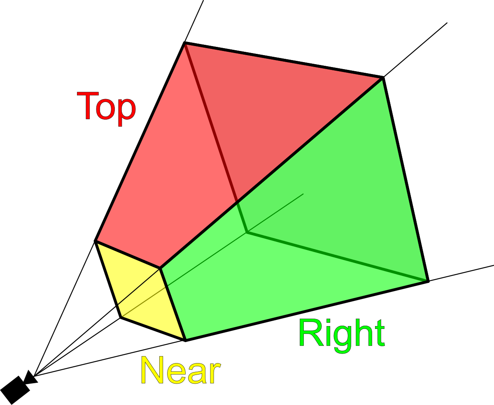
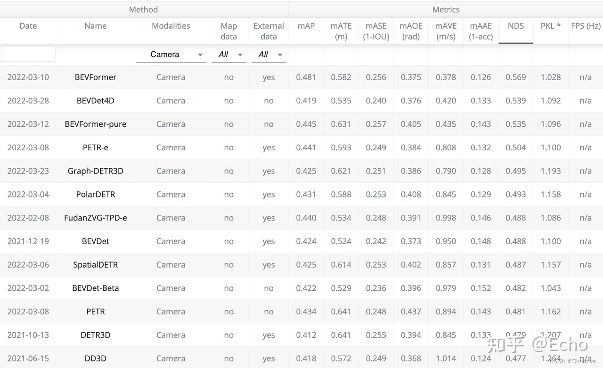

@[TOC](目录)

## 基本概念

1 PV（Perspective View）：透视视角

![\[Image\]](../images/82ca45a60ee44eae9fe5297d1fee8235.png)

2 BEV （Bird Eye View）：鸟瞰视角

![\[Image\]](../images/66b5b97b068d43859eaea37599ab79b6.png)

3 IPM (Inverse Perspective Mapping)：逆投影变换

水平平面及固定相机外参假设，容易出现假设不成立的情况

![\[Image\]](../images/770cad2db8c04fc595d06792bfb6cedf.png)

Camera Frustum Space：相机的视锥空间

- 相机内参：与相机自身特性相关的参数，比如焦距、像素大小等
- 相机外参：相机在真实世界坐标系中的参数，比如相机的安装位置、旋转方向等

[相机模型中四个坐标系的关系](./docs/02-车载相机及图像处理?id=相机模型中四个坐标系的关系)

## 背景

个人理解，BEV模型在自动驾驶中的兴起主要是从模型端统一了感知和下游决策规划的几何空间。自动驾驶的运动场景基本是在一个平面，在BEV下规划出的可通行轨迹在3D空间里也是可通行的。

在BEV模型之前，我们也需要完成将感知检测结果投影到BEV的过程。对于激光雷达来说，这个转换信息是足够的。

以为我司为例，最早的检测大模型是以点云做输入的FEN，可以直接输出object的3D尺寸和朝向等信息，可以方便地投影到BEV。与激光雷达不同，单个相机是没有直接的深度信息的，如果要用相机直接检测出object并投影到BEV，需要实现3D检测或者直接在BEV检测。

最直观的检测任务是2D目标检测，比如给出某张图片不同对象的语义标签及bounding box。从图中的信息要转化BEV上应该如何做呢？

![\[Image\]](../images/1af39e813286431caf173c7b1c6ba32c.png)

如何从2D图片中检测出深度，是一个有意思的问题。常见的思路包括IPM、双目相机、Mono3D等。我司也上线过Mono3D的模型。

## BEV优势
1. 多相机融合和多模融合更易实现
	  - 不需要规则后处理转化视角完成关联
	  - 检测物体的大小和朝向能直接得到表达
2. 相比2D检测远处精度更高
	- 同一像素的偏差远处对应的距离更大
3. 时序融合更易实现
4. 可“脑补”出遮挡区域的目标
	- 避免透视效应
5. 更方便端到端做优化
	  - 方便加轨迹预测

## 基本方案
BEV模型的挑战在于实现从PV到BEV的转换以及数据真值的获取（比如用无人机采、带lidar的多传感器采集作为真值等）。

![\[Image\]](../images/d260a41f6bf8416bb477540576b0dae7.png)

## 输入

按照输入的传感器模态，BEV也可以分为BEV Camera， BEV Lidar， BEV Fusion等。以BEV Camera为例，输入为多张相机输出的图片。

## 输出

3D检测结果或者BEV图

## 参考结构

petr 纯视觉方案：

![\[Image\]](../images/4733ad0527cf436abf69b963f3dec1f6.png)

## 数据集

Waymo, Nuscenes, Argoverse均有用于BEV感知的数据集及相应的预测数据。

![\[Image\]](../images/1b3a4972b71142038c9959d66737c637.png)
dataset format

## 评价指标
- mAP （mean Average Precision）
	The mean Average Precision (mAP) is similar to the well-known AP metric in the 2D object detection, but the matching strategy is replaced from IoU to the 2D center distance on the BEV plane. The AP is calculated under different distance thresholds: 0.5, 1, 2, and 4 meters. The mAP is computed by averaging the AP in the above thresholds

- NDS （Nuscenes Detection Score）
	The nuScenes detection score (NDS) is a combination of several metrics: mAP, mATE (Average Translation Error), mASE (Average Scale Error), mAOE (Average Orientation Error), mAVE (Average Velocity Error) and mAAE (Average Attribute Error). The NDS is computed by using the weight sum of the above metrics. The weight of mAP is 5 and 1 for the rest.

![\[Image\]](../images/e0374378422f491aac2cd7a31ed918a7.png)

## 损失函数

## 关键技术

从2D图片或feature实现到3D空间的映射是BEV的关键技术点。

The 2D-3D method is introduced by LSS [57], where it predicts depth distribution per grid on 2D feature, then “lift” the 2D feature per grid via the corresponding depth to voxel space, and perform downstream tasks following LiDAR-based methods.

![\[Image\]](../images/ec842648a7b24012ae548b0dfbe4bfc2.png)

## 案例分析 BEVFormer 

本文提出了一套基于Transformer和时序模型在鸟瞰图视角下优化特征的环视物体检测方案，即BEVFormer。nuScenes数据集上以NDS指标（类似mAP），在camera only赛道中 大幅领先 之前方法。本文旨在介绍作者在设计BEVFormer过程中考虑的思路、比较的多种方法、以及下一步可能的研究方向。

### 介绍

最近，基于多视角摄像头的3D目标检测在鸟瞰图下的感知（Bird's-eye-view Perception, BEV Perception) 吸引了越来越多的注意力。一方面，将不同视角在BEV下统一与表征是很自然的描述，方便后续规划控制模块任务；另一方面，BEV下的物体没有图像视角下的尺度(scale)和遮挡(occlusion)问题。如何优雅的得到一组BEV下的特征描述，是提高检测性能的关键。

nuScenes自动驾驶数据集因其数据的质量、规模与难度都比之前数据集有大幅提升，而获得了很多研究者的关注。在nuScenes 3D object detection task上，目前前6名方案都是2022年3月进行的提交。作者提出的BEVFormer取得了48.1 mAP和56.9 NDS，两个指标均超越现有方法3个点以上，暂列第一。“低碳版”BEVFormer-pure仅使用ResNet-101与单尺度测试，取得了优于第二名（Swin-B、test-time aug）的mAP以及相同的NDS。具体榜单和Demo视频如下。

Table: BEVFormer 在nuScenes榜单上的排名（截至2022.3.31）

    <video autoplay muted loop src="https://user-images.githubusercontent.com/27915819/161392594-fc0082f7-5c37-4919-830a-2dd423c1d025.mp4?raw=true" style="border-radius: 10px; width: 100%;"></video>

Demo: BEVFormer，一种全新的环视目标检测方案本项目最早启发于2021年7月特斯拉的技术分享会，为此作者还做了几期细致的分享（链接TODO）。特斯拉展示了基于Transformer使用纯视觉输入进行自动驾驶感知任务的惊艳效果，但是它并没有展示其方法的具体实现和量化指标。与此同时，学术界也有许多相关工作旨在利用纯视觉输入来完成自动驾驶感知任务，例如3D目标检测或者构建语义地图。作者提出的BEVFormer的主要贡献在于**使用Transformer在BEV空间下进行时空信息融合。**

### BEVFormer方案

BEVFormer动机：使用可学习的BEV query通过attention与spatial space 和temporal space交互 

### 动机

在介绍BEVFormer的具体方案之前，先要回答两个问题。

**1: 为什么要用BEV?**

事实上对于基于纯视觉的3D检测方法，基于BEV去做检测并不是主流做法。在nuScenes 榜单上很多效果很好的方法（例如DETR3D, PETR）并没有显式地引入BEV特征。从图像生成BEV实际上是一个ill-posed问题，如果先生成BEV,再利用BEV进行检测容易产生复合错误。但是作者仍然坚持生成一个显式的BEV特征，原因是因为一个显式的BEV特征非常适合用来融合时序信息或者来自其他模态的特征，并且能够同时支撑更多的感知任务。

**2: 为什么要用时空融合？**

时序信息对于自动驾驶感知任务十分重要，但是现阶段的基于视觉的3D目标检测方法并没有很好的利用上这一非常重要的信息。时序信息一方面可以作为空间信息的补充，来更好的检测当前时刻被遮挡的物体或者为定位物体的位置提供更多参考信息。除此之外时序信息对于判断物体的运动状态十分关键，先前基于纯视觉的方法在缺少时序信息的条件下几乎无法有效判断物体的运动速度。

BEVFormer Pipeline

BEVFormer整体框图

**1. 定义BEV queries**  

作者定义了一组维度为H*W*C的可学习参数作为BEV queries, 用来捕获BEV特征。在nuScenes数据集上，BEV queries 的空间分辨率为200*200，对应自车周围100m*100m的范围。BEV queries 每个位于(x, y)位置的query都仅负责表征其对应的小范围区域。BEV queries 通过对spatial space 和 tempoal space 轮番查询从而能够将时空信息聚合在BEV query特征中。最终作者将BEV queries 提取的到的特征视为BEV 特征，该BEV特征能够支持包括3D 目标检测和地图语义分割在内的多种自动驾驶感知任务。

**2. Spatial Cross-Attention**  

如上图(b)所示，作者设计了一中空间交叉注意力机制，使BEV queries 从多相机特征中通过注意力机制提取所需的空间特征。由于本方法使用多尺度的图像特征和高分辨率的BEV特征，直接使用最朴素的global attention 会带来无法负担的计算代价。因此作者使用了一种基于deformable attention 的稀疏注意力机制时每个BEV query之和部分图像区域进行交互。具体而言，对于每一个位于(x, y)位置的BEV特征，作者可以计算其对应现实世界的坐标x',y'。 然后作者将BEV query进行lift 操作，获取在z轴上的多个3D points。 有了3D points, 就能够通过相机内外参获取3D points 在view 平面上的投影点。受到相机参数的限制，每个BEV query 一般只会在1-2个view上有有效的投影点。基于Deformable Attention, 作者以这些投影点作为参考点，在周围进行特征采样，BEV query使用加权的采样特征进行更新，从而完成了spatial 空间的特征聚合。

**3. Temporal Self-Attention**  

从经典的RNN网络获得启发，作者将BEV 特征视为类似能够传递序列信息的memory。 每一时刻生成的BEV特征都从上一时刻的BEV特征获取了所需的时序信息，这样保证能够动态获取所需的时序特征，而非像堆叠不同时刻BEV特征那样只能获取定长的时序信息。具体而言，给定上一时刻的BEV 特征，作者首先根据ego motion 来将上一时刻的BEV特征和当前时刻进行对齐，来确保同一位置的特征均对应于现实世界的同一位置。对于当前时刻位于(x, y)出的BEV query, 它表征的物体可能静态或者动态，但是作者知道它表征的物体在上一时刻会出现在(x, y)周围一定范围内，因此作者再次利用deformable attention 来以(x, y)作为参考点进行特征采样。作者并没有显式地设计遗忘门，而是通过attention 机制中的attention wights来平衡历史时序特征和当前BEV特征的融合过程。每个BEV query 既通过spatial cross-attention 在spatial space下聚合空间特征，还能够通过temporal self-attention 聚合时序特征，这个过程会重复多次确保时空特征能够相互促进，进行更精准的特征融合。 

**4. 使用BEV特征支撑多种感知任务**  

一个显式的BEV特征能够被用于3D目标检测和地图语义分割任务上。 常用的2D检测网络，都可以通过很小的修改迁移到3D检测上。作者也验证了使用相同的BEV特征同时支持3D目标检测和地图语义分割，实验表明多任务学习能够提升在3D检测上的效果。

### 实验效果

作者在nuScenes上的实验结果表明了BEVFormer的有效性。在其他条件完全一致下，使用时序特征的BEVFormer比不使用时序特征的BEVFormer-S 在NDS指标上高7个点以上。尤其是**引入时序信息之后，基于纯视觉的模型真正能够预测物体的移动速度，这对于自动驾驶任务来说意义重大。**

作者还证明了模型同时做检测和分割任务能够提升在3D检测任务上的性能，基于同一个BEV特征进行多任务学习，意义不仅仅在于提升训练和推理是的效率，更在于基于同一个BEV特征，多种任务的感知结果一致性更强，不易出现分歧。

在下面这个场景下，BEVFormer基于纯视觉输入得到的检测结果跟真实结果十分接近, 再BEV视角下的分割结果和检测结果也有着非常好的一致性。

### 相关工作

自动驾驶场景中，基于BEV空间的感知系统能够给系统带来巨大的提升。在经典的自动驾驶感知系统中，camera感知算法工作在2D空间，LiDAR/RaDAR感知算法工作在3D空间。下游的融合算法通过2D与3D之间的几何关系对感知结果进行融合。由于融合算法仅对感知结果进行融合，会丢失大量的原始信息，同时手工设计的对应关系难以应对复杂的场景。在基于BEV空间的感知系统中，Camera，LiDAR，RaDAR的感知均在BEV空间中进行，有利于多模态感知融合。而且，融合过程较传统方法提前，能充分利用各个传感器的信息，提升感知性能。将camera feature从仿射视角perspective转换到鸟瞰图BEV视角，一般使用IPM（inverse perspective mapping) 和MLP (multi-layer perception)，近来也有工作使用Transformer结构。

- 工业界方案：特斯拉

BEVFormer正是在特斯拉技术分享会后收到的启发。TESLA在AI DAY的技术演讲中也对基于BEV的检测进行了介绍，Tesla使用tranformer将不同视角的图像转换至BEV空间下，再在BEV空间进行物体检测。详细技术分享细节参见：BEVFormer。

- 工业界方案：地平线/毫末智行以BEV为中心的感知方案同样受到了国产厂商的关注。国产厂商中，地平线和毫末智行均公开展示过其感知方案使用BEV范式。

  

毫末感知架构图

地平线架构图

无论地平线还是毫末智行，BEV范式均在其感知系统中起到了重要的作用。神经网络通过数据驱动，将不同传感器的数据映射到BEV空间中，继而根据BEV特征进行空间与时间融合，从而获取到对场景(空间及时间)的抽象表征。最后由BEV表征出发，输出不同任务的结果。由于BEV范式感知能大规模利用原始数据进行抽象建模，减少人为设计，感知系统融合性能得到了显著的提高。可以预见会有越来越多的国产厂商使用BEV这种新型的感知范式。

- **学术界论文：**
Projecting Your View Attentively: Monocular Road Scene Layout Estimation via Cross-view Transformation (PYVA, CVPR 2021)

PYVA使用MLP进行perspective到BEV的转换，在完成转换后，再使用一个MLP将BEV feature X'转换回perspective view，并通过X与X''进行约束。然后使用tranformer融合BEV feature X'和perspective feature X''，再通过数据约束获得BEV表征。 

PYVA由两个MLP构成，一个将原始特征X从perspective转换到BEV X'，另一个将BEV X'转换回perspective X"，两个MLP通过X与X''进行约束。然后使用tranformer融合BEV feature X'和perspective feature X''，再通过数据约束获得BEV表征。 

- **学术界论文：**Translating Images into Maps https://arxiv.org/abs/2110.00966

Translateing images into maps发现，无论深度如何，在图像上同一列的像素在BEV下均沿着同一条射线，因此，可以将每一列转换到BEV构建BEV feature map。作者将图像中每一列encode为memory，利用BEV下射线的半径query memory，从而获得BEV feature，最后通过数据监督使模型拥有较好的视角转换能力。

- **学术界论文：**DETR3D: 3D Object Detection from Multi-view Images via 3D-to-2D Queries (DETR3D, CoRL 2021)

DETR3D虽然没有直接使用BEV feature，但DETR3D直接在BEV视角下进行物体检测。通过解码的物体三维位置及相机参数，利用2D图片对应位置的feature不断refine物体3D位置，从而达到了更好的3D物体检测性能。

- **学术界论文：**PETR: Position Embedding Transformation for Multi-View 3D Object Detection

PETR 在DETR3D的基础上更进一步，为每个2D视角添加了3D位置特征，与之前的Lift-Spalt-Shot类似，PETR使用深度分布来表征每个2D像素潜在的深度信息。将相机空间下的坐标系转换成世界坐标系之后，能为所有视角提供一个统一的3D位置特征。不同于DETR3D, PETR无需让query回归3D框的中心点然后投影到2D视角下聚合特征，PETR直接使用类似DETR那样的全局cross-attention自适应的学习所需特征。

### 下一步工作

相信读到这里的小伙伴都是作者的铁粉，且坚定相信BEV Perception会是下一代自动驾驶感知算法框架的主流趋势。这里作者也给大家分享下基于BEVFormer的最新思考，希望和业界同仁一起探索这个方向。

一方面，把BEVFormer扩展成多模态、与激光雷达融合是一个很自然的想法。作者注意到最新的DeepFusion工作也已经揭开其神秘的面纱。这里面一个关键的点是如何正确align Lidar query feature和相机下的特征；在deepFusion实现中，InverseAug是保证特征一致的重要操作。该方法在目前Waymo 3D Detection榜单中也独占鳌头。

另一方面，如何以纯视觉的设定，优化当前pipeline, 把性能提升至和Lidar差不多的结果也是一件非常有挑战的事情。这里面一个关键因素是如何以相机2D的信息输入，得到一个准确的3D空间位置估计，即基于图像的（稠密）深度估计。在这方面发力的影响力要远远大于单纯的Sensor Fusion.

## 更多内容和阅读

自动驾驶BEV感知有哪些让人眼前一亮的新方法？

https://www.zhihu.com/question/521842610

