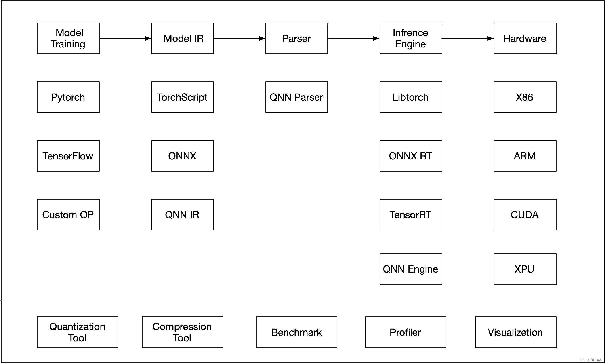
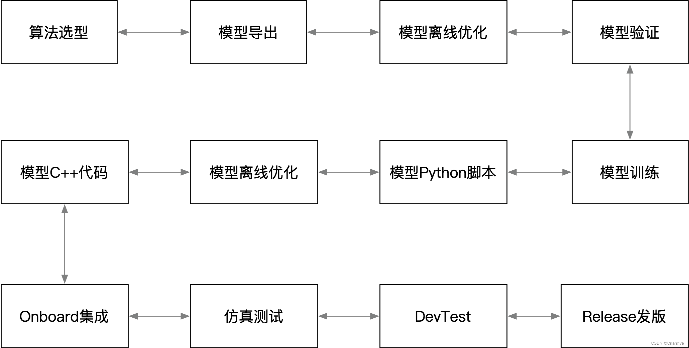

@[TOC](目录)

1. 数据选择（数据采集、数据增强）
2. 数据标注
3. 模型训练
4. 模型量化
5. 模型部署
6. 测试与验证

### 一、感知算法生产流程

### 二、算法模型部署流程

### 二、各个阶段交付物

- 算法选项：python代码，可以复现
- 模型导出：ONNX模型
- 模型验证：验证报告，包含在特定硬件平台是否能运行、性能、以及详细的各个算子时间
- 模型训练：python代码，可以复现
- 模型导出：ONNX模型
- 模型python运行脚本开发：基于ONNXRuntime的推理python代码，IO数据文件
- 模型的离线优化：ONNX模型
- 模型C++代码开发：C++代码，结果对齐python代码
- Onboard集成：模型在Onboard被集成在perception模块内部
- 仿真测试：测试结果
- DevTest：测试结果
- Release发版：模型+代码，提交到代码库
